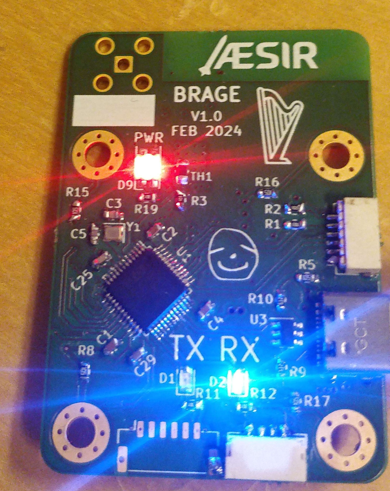
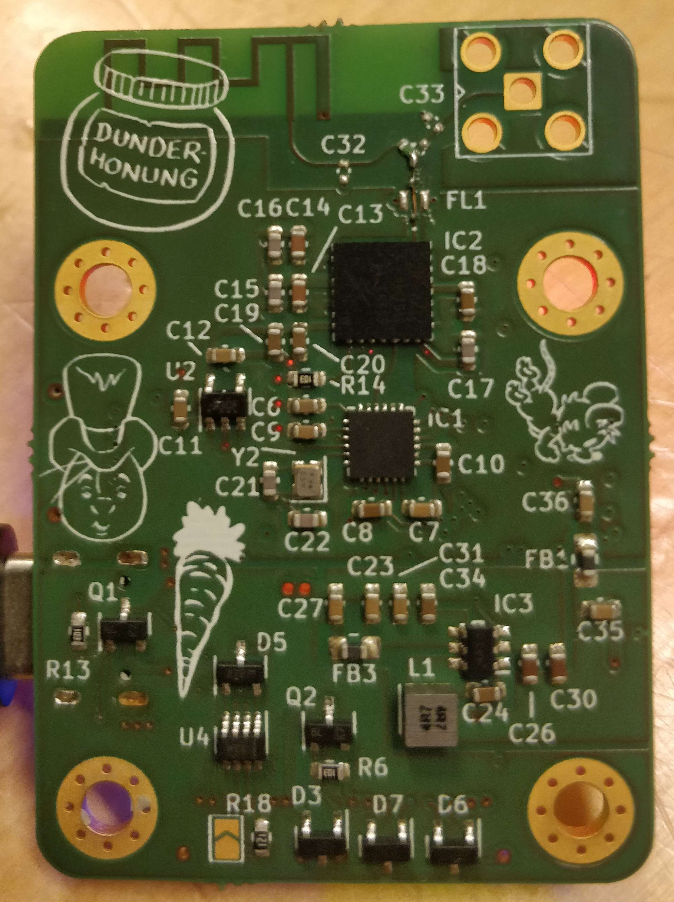

## Brage Telemetry modem
Brage is a 1W 2.4GHz Telemetry modem that can listen and transmit from a CAN-bus. The name comes from the norse god of poetry, Brage, who will tell the tales of the rocket.

<!-- 
 -->

 

### Features
* 2Mbit/s
* Time of Flight ranging
* CAN FD with SIC
* UART
* USB
* PCB antenna

### Hardware
The modem is based on an STM32U575CG and an SX1280 transceiver. The radio signal is put through a frontend, filtering and amplifying it to 30dBm. The UART and CAN connectors follow the PixHawk standard while the debugging port is custom.